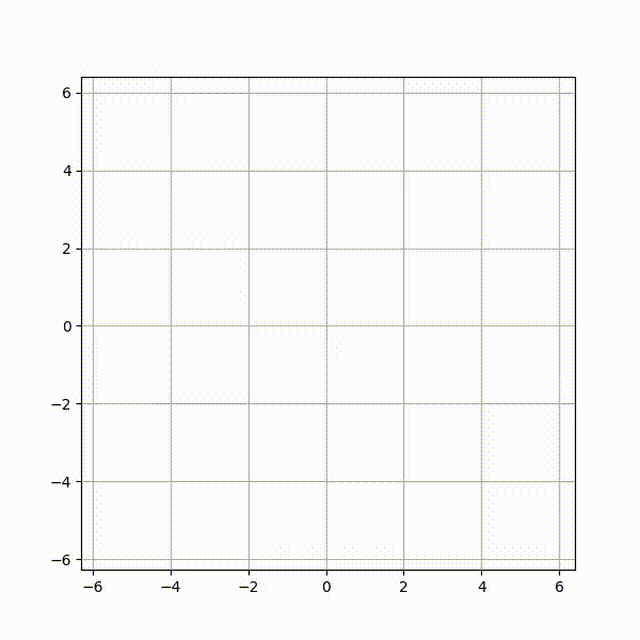
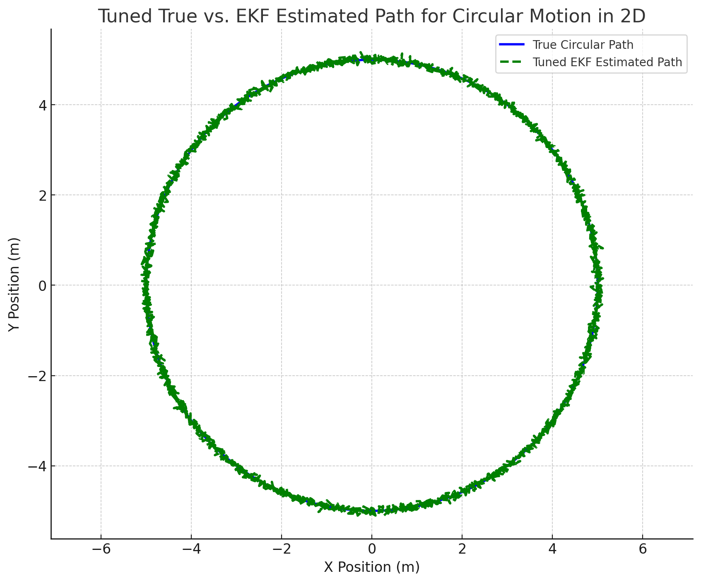
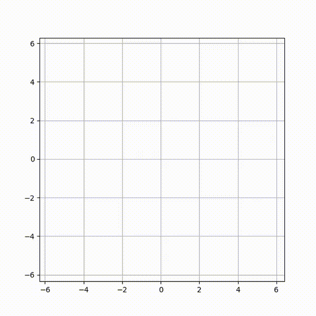
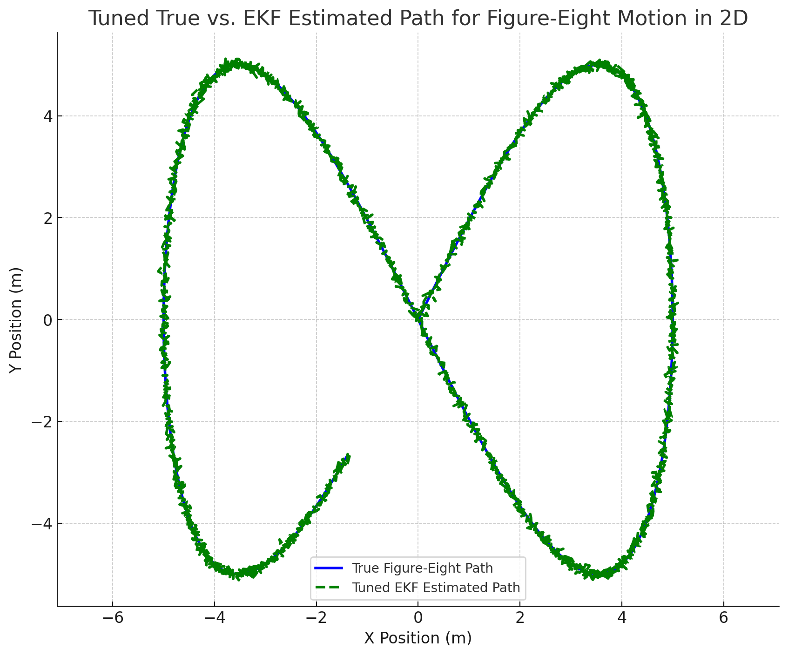

# Extended Kalman Filter Project

This repository contains a series of Python scripts that implement and visualize an Extended Kalman Filter (EKF) for motions made by person while He/She is making a video, including circular and figure-eight paths on dummy data.

## Project Structure

- **main.py**: The entry point of the project. Runs the complete EKF simulation.
- **preprocessing.py**: Handles preprocessing of input data, including filtering and cleaning.
- **data_generation.py**: Generates the synthetic data for testing the EKF, including circular and figure-eight paths.
- **ekf.py**: Implements the Extended Kalman Filter (EKF) logic for estimating state.
- **kalman_filter.py**: Contains a general Kalman Filter implementation that is utilized by the EKF.
- **visualization.py**: Handles visualization of results, including generating 2D plots and animations.

## Requirements

The project requires the following Python packages, which can be installed using the provided `requirements.txt`:

```bash
pip install -r requirements.txt
```

## Visualizations
### Circular Motion Tracking

 

### Figure-Eight Motion Tracking

 

Two types of visualizations are generated to show the performance of the EKF:
1. **2D Position Plot**: Comparison between true and estimated paths for different types of motion (e.g., circular, figure-eight).
2. **Tracking Animations**: GIFs showcasing the real-time tracking performance of the EKF.

## Getting Started

1. Clone the repository:

   ```bash
   git clone <repository-url>
   cd <repository-folder>
   ```

2. Install the required dependencies:

   ```bash
   pip install -r requirements.txt
   ```

3. Run the main script to see the EKF in action:

   ```bash
   python main.py
   ```

## File Descriptions

- **output_1.png** and **output_2.png**: Images showing the results of EKF on circular and figure-eight paths.
- **tracking_1.gif** and **tracking_2.gif**: GIFs providing visualizations of the EKF in action for circular and figure-eight motions.

## License

This project is licensed under the MIT License. See the LICENSE file for more information.
