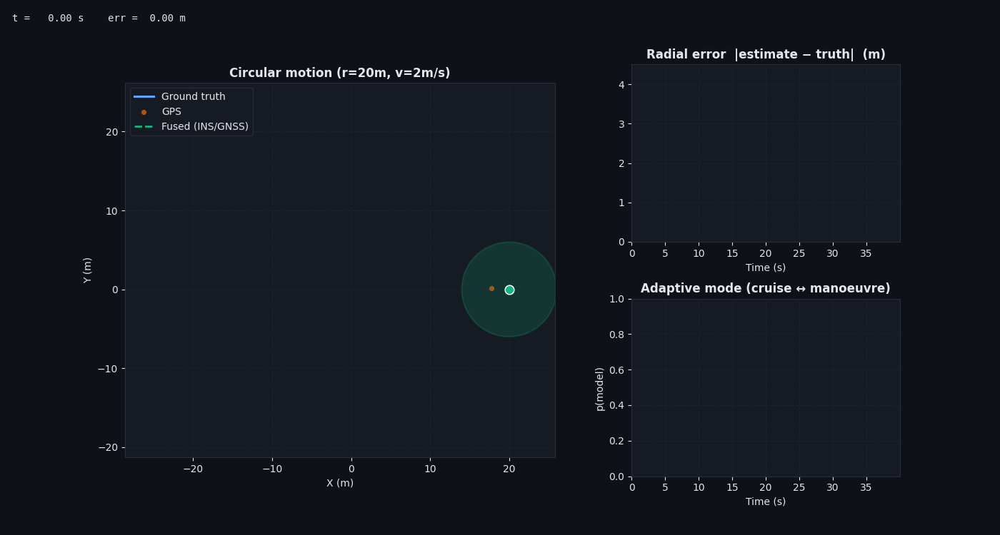
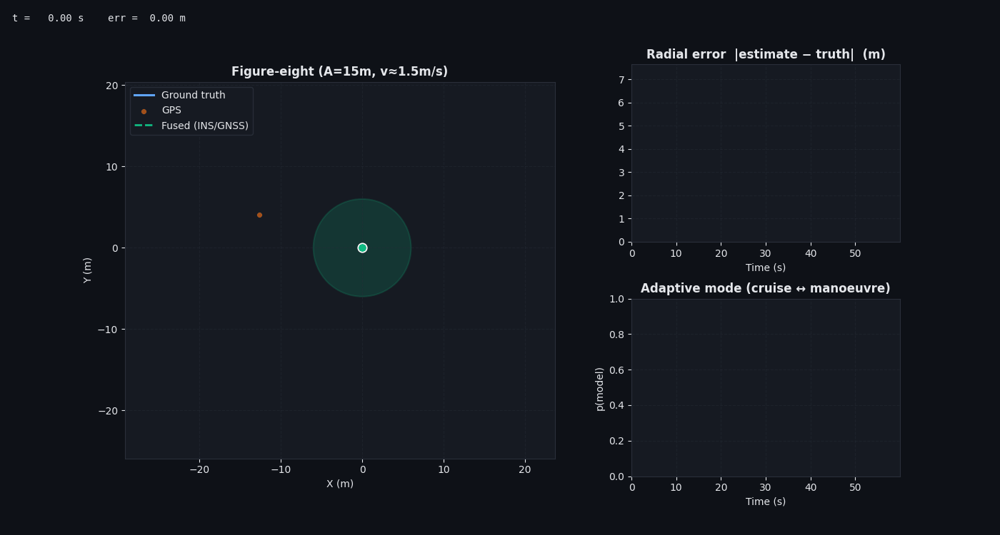
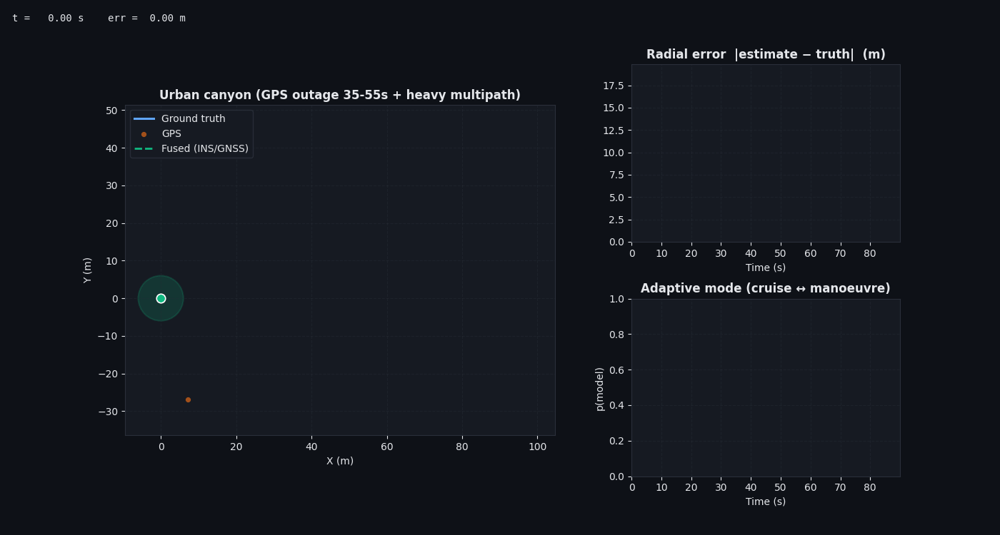
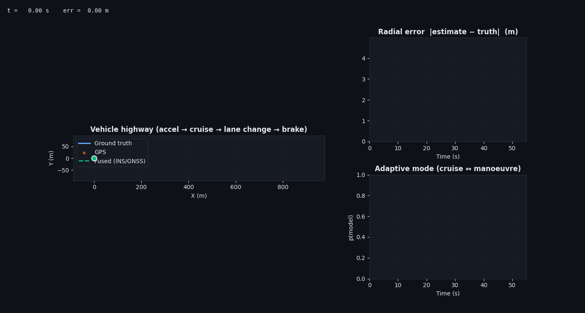
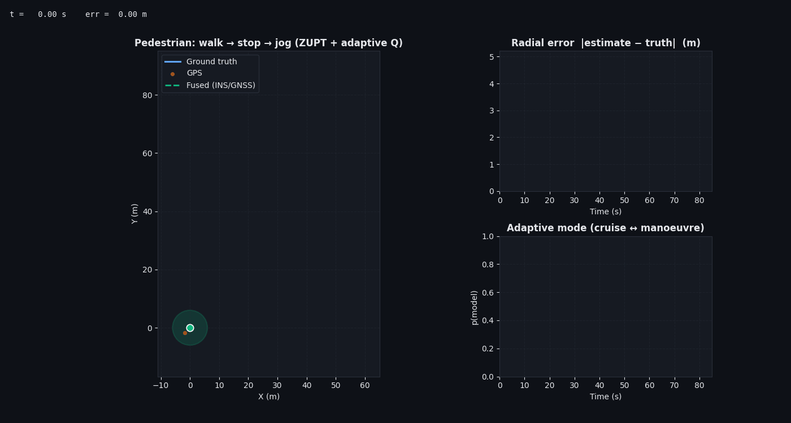
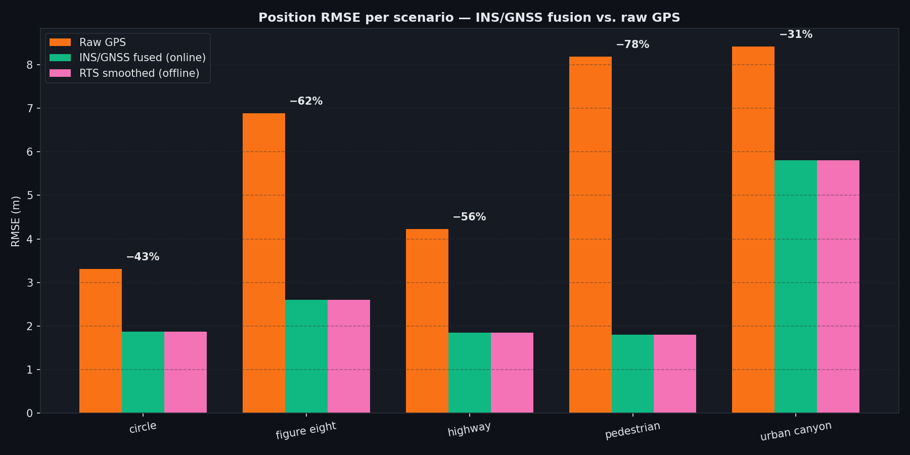

# Tracking-Person-Movement-Using-Mobile-Sensor-Data

A state of the art tracking Python based tracker for tracking person / vehicle movement by
fusing IMU (accelerometer + gyroscope), GPS, and magnetometer data. Here, I have  implemented modernised filter design, adding proper sensor fusion and outlier handling, and benchmarking across five realistic scenarios.

## Benchmark Results 

### Tracking 

| Scenario | Animation |
|---|---|
| Circular motion |  |
| Figure-eight |  |
| Urban canyon (GPS outage + multipath) |  |
| Vehicle on highway |  |
| Mixed-mode pedestrian |  |

Each dashboard shows: bird's-eye trajectory view with 2-σ uncertainty ellipses
(left), radial error vs. time (top-right), and the adaptive cruise↔manoeuvre
mode indicator (bottom-right).

Mean improvement over raw GPS across five scenarios: **−54 %**



| Scenario | Samples | Raw-GPS RMSE | Fused RMSE | CEP50 | Max err | Improvement |
|---|---:|---:|---:|---:|---:|---:|
| Circle (r=20m, v=2 m/s) | 4 439 | 3.31 m | **1.87 m** | 1.58 m | 3.92 m | −43 % |
| Figure-eight | 6 659 | 6.88 m | **2.60 m** | 1.68 m | 6.66 m | −62 % |
| Urban canyon (20 s GPS outage + multipath) | 9 968 | 8.41 m | **5.81 m** | 3.24 m | 17.3 m | −31 % |
| Highway (accel → cruise → lane change → brake) | 6 104 | 4.23 m | **1.85 m** | 1.47 m | 4.34 m | −56 % |
| Pedestrian (walk + stop + jog) | 9 434 | 8.18 m | **1.80 m** | 1.51 m | 4.54 m | −78 % |


### Architecture

```
┌─────────────────────────────────────────────────────────────┐
│                  INSTracker (error-state EKF)               │
│                                                             │
│    state x = [px, py, vx, vy, ψ, bax, bay, bgz]             │
│                                                             │
│    ┌─────────────┐      ┌─────────────────────────┐         │
│    │  IMU 100 Hz │ ───► │ strap-down propagation   │         │
│    │ (acc, ωz)   │      │  (Groves 2013, ch. 14)  │         │
│    └─────────────┘      └──────────┬──────────────┘         │
│                                    │                        │
│    ┌─────────────┐                 ▼                        │
│    │  GPS 1 Hz   │ ───► NIS gate  (χ² outlier test)         │
│    │  (x, y)     │                 │                        │
│    └─────────────┘                 ▼                        │
│                          Joseph-form update                 │
│    ┌─────────────┐                 ▲                        │
│    │ Mag 10 Hz   │ ─────────────────┘                       │
│    │  (heading)  │                                          │
│    └─────────────┘                                          │
│                                                             │
│    + ZUPT (guarded by speed)                                │
│    + adaptive process noise (cruise ↔ manoeuvre EMA)        │
│    + RTS smoother (offline post-processing)                 │
└─────────────────────────────────────────────────────────────┘
```

### Key techniques

1. **Error-state EKF with IMU-driven strap-down propagation**
   High-rate IMU integrates body-frame acceleration (rotated to global frame
   via the current heading) and yaw rate. Position, velocity, heading, and
   bias states are propagated at IMU rate (100 Hz). GPS and magnetometer
   measurements correct the drift at their native rates. This is the
   loosely-coupled INS/GNSS design used in ArduPilot, PX4, and the ROS
   `robot_localization` package.

2. **Online accelerometer and gyroscope bias estimation** with tight priors
   (σ=0.03 m/s², 0.003 rad/s) and slow random-walk noise so the filter
   cannot absorb real accelerations as "bias".

3. **Joseph-form covariance update**
       P = (I − KH) P (I − KH)ᵀ + K R Kᵀ
   which is symmetric and positive-semidefinite by construction even under
   finite-precision arithmetic.

4. **Normalised Innovation Squared (NIS) gating** with a χ² threshold of 16
   (≈ 99.9 % confidence for 2-DOF) to reject GPS multipath spikes.

5. **Guarded Zero-Velocity Update (ZUPT)** — crucial for pedestrian
   tracking but a classic failure mode when naively applied: a car in
   steady cruise has zero body-frame acceleration (same IMU signature as
   stationary). The implementation requires *both* a quiet IMU window
   *and* the filter's current velocity estimate to be below 0.5 m/s before
   injecting the zero-velocity pseudo-measurement.

6. **Adaptive process noise** — an EMA-tracked "mode indicator" in [0, 1]
   inflates Q by up to 4× when GPS innovations are large, letting the
   filter track rapid manoeuvres without lag.

7. **Rauch-Tung-Striebel smoother** for offline post-processing. Runs a
   backward pass over the filtered track to refine past estimates using
   future measurements.

8. **Reusable UKF + IMM library** (`src/ukf.py`, `src/imm.py`) with Merwe
   sigma points, adaptive-R, and proper circular-quantity residuals. Not
   used by the default tracker (the INS/EKF is simpler and performs as
   well on these scenarios), but exposed for users wanting to experiment.

### Motion-model library

`src/motion_models.py` implements three canonical models with analytical
Jacobians verified against finite differences to 1e-11 precision:

* `ConstantVelocity` — 4-state `[x, y, vx, vy]`, CWNA discretised Q
* `ConstantAcceleration` — 6-state `[x, y, vx, vy, ax, ay]`, CWNJ Q
* `CTRV` (Constant Turn Rate & Velocity) — 5-state `[x, y, v, ψ, ψ̇]` with
  the usual v/ψ̇ → 0 limit handling and heading-rate clamping

## Repository Layout

```
sota_tracker/
├── src/
│   ├── motion_models.py      CV / CA / CTRV with Jacobians + Q
│   ├── ukf.py                Unscented Kalman Filter
│   ├── imm.py                Interacting Multiple Models filter
│   ├── ins_tracker.py        Loosely-coupled INS/GNSS tracker (default)
│   ├── simple_ins.py         Simpler 5-state INS without bias estimation
│   ├── tracker.py            Legacy IMM tracker + sample types
│   ├── scenarios.py          Five benchmark scenarios + sensor noise model
│   └── visualize.py          Dashboard GIFs, static plots, theme
├── step1_run_filters.py      Runs all filters, caches results
├── step2_static_plots.py     PNG trajectory comparisons
├── step3_one_gif.py          Renders one scenario animation
├── step4_summary.py          Benchmark bar chart + Markdown
├── run_all.py                Single entrypoint (older, sequential)
└── outputs/                  Generated PNGs, GIFs, summary.md
```

## Running the Benchmark

```bash
pip install numpy scipy matplotlib pillow

# Step 1: run filters on all five scenarios, cache results (~8 s)
python step1_run_filters.py

# Step 2: static trajectory plots (~1 s)
python step2_static_plots.py

# Step 3: dashboard GIFs (one at a time, each ~15-30 s)
for s in circle figure_eight urban_canyon highway pedestrian; do
    python step3_one_gif.py $s
done

# Step 4: summary figure + markdown
python step4_summary.py
```

## sample code to use tracker 

```python
from src.ins_tracker import INSTracker
from src.tracker import IMUSample, GPSSample, MagSample
import numpy as np

tr = INSTracker()
tr.initialize(pos=np.array([0.0, 0.0]), heading=0.0, speed=0.0, t0=0.0)

# Feed samples in timestamp order:
tr.step(IMUSample(t=0.01, acc=np.array([0.0, 0.0]), omega_z=0.0))
tr.step(GPSSample(t=1.0, pos=np.array([1.2, 0.1]), sigma=2.5))
tr.step(MagSample(t=1.05, heading=0.05, sigma=0.1))

# Query:
times, poses, covs = tr.trajectory()
# poses[:, :2] is (x, y); poses[:, 2:4] is (vx, vy); covs are 4x4 pose cov.
```

## Author

Tanup Vats

## License

Apache License
